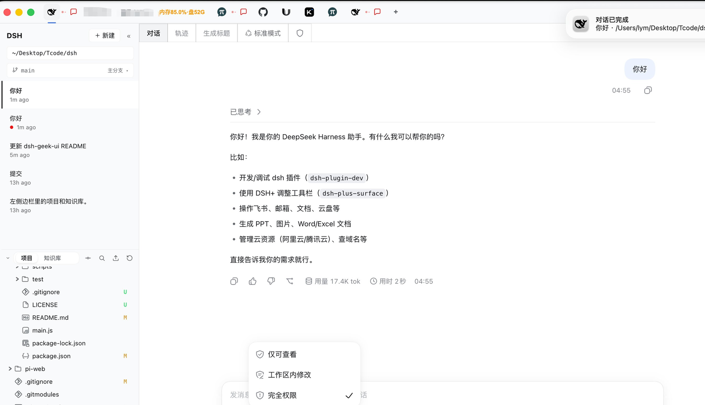

# DSH+

给 [DeepSeek Harness](https://github.com/deepseek-ai/deepseek-harness) 套一个**原生桌面窗口**的多应用壳。它不止是"桌面版"，更把多智能体协作里最容易被忽略的**消息通知**补齐成刚需功能。



  

## 它特别在哪

### 1. 不绑定任何 DSH 版本——为所有版本的 Harness 套一个壳

**壳与内容彻底解耦。** DSH 本体和插件在 `~/.dsh` 里照常更新升级，壳内部**不绑死版本号**。所以 **DSH 每发一次新版本，你不用跟着重新打包这个壳**——它天然兼容任意版本，装完即用。

### 2. 消息通知——多智能体协作的刚需

装上插件后，**无论你的 DSH 在本地还是远程**，都能拿到消息通知：

- 会话**完成**、**等待你回应**（待交互/未读）时，壳会推给你系统通知。
- 除了 DSH 会话，**你也可以把其他消息源推到上面**，统一收口。
- 通知图标采用苹果 **Touch Bar** 的设计灵感——功能区就是一条"外接状态条"，把进行中会话数、待交互/未读气泡、Dock 角标、系统通知渲染成直观的状态。

> **需要在系统里开启。** 系统通知默认是**关闭**的，用之前请先开启：左侧工具栏**第一个鲸鱼图标（DSH）上右键** → **「通知设置」**，并在 **macOS 系统设置 → 通知 → DSH+** 里允许通知。只在壳退到后台时才推送，前台不打扰。

### 3. 兼容 pi-web，也能加任何网页

不只是 DSH。**当你也在用 pi-web**（本地或远程），装上对应插件后同样能收到"消息完成通知"。而且功能区的 `+` 可以添加**任意 `http(s)` 本地服务或网页**——把常用的工具都收进一个桌面窗口里。

## 核心能力

- **免打包免签名运行**：`npm install && npm start` 直接跑，无需签名。
- **自动连接 dsh web**：扫描本机端口命中 dsh 特征，也能 `+` 手动加任意应用（不写死端口）。
- **消息通知**：完成 / 待交互系统通知，仅后台推送（需在系统里开启）。
- **显示面管道**：功能区 **Fact → Item → Hub** 把会话状态渲染成角标与气泡（配 `plugins/dsh-plus-surface`）。
- **托盘守护**：关窗口不退出，鲸鱼图标保留；完全退出时才停止当前端口上的 dsh。
- **原生右键兜底**：补裁剪/复制/粘贴、链接、图片、刷新、开发者工具，并避开页面自有菜单。
- **本地应用启动器**：在 `recipes/recipe.json` 加一条即可出现在条目带，一键启动任意应用。

## 运行

```bash
cd dsh-plus
npm install
npm start          # = electron .
```

**前置**：本机已安装 [DSH](https://www.npmjs.com/package/@deepseek-ai/dsh)（`npm i -g @deepseek-ai/dsh`）。未安装时壳会弹出版本选择面板，一键安装并自动拉起。

### 连接 dsh web（不写死端口）

1. 显式 `DSH_URL` 环境变量（最高优先）
2. 扫描本机监听端口，命中 dsh 特征（见 `lib/detect-dsh.js`）
3. 都没找到且允许自动拉起：自选空闲端口（从 3080 起），`dsh web --port N --no-open` 并等待就绪

| 变量 | 作用 |
|------|------|
| `DSH_URL` | 显式地址，如 `http://127.0.0.1:8080` |
| `DSH_SHELL_NO_SPAWN=1` | 禁止自动拉起 dsh |
| `DSH_SHELL_SIGNATURES` | 覆盖检测特征（逗号分隔，官方改版救场） |
| `DSH_SHELL_NATIVE_MENU=0` | 关闭应用区原生右键菜单兜底 |

dsh **0.1.2+** 浏览器鉴权：壳在能拿到 launch token 时静默换 cookie 再加载页面；换不到则走官方 401，不替换成引导页。

## 会话状态与显示面（推荐装插件）

配 `plugins/dsh-plus-surface` 插件后：

```bash
dsh plugin --profile web add <本仓库 plugins/dsh-plus-surface 绝对路径>
# 部署到 ~/.dsh/profiles/web 后在该目录 pnpm install --force 重打包
```

- **进行中**：DSH 图标左上角绿色角标（进行中会话数）
- **待交互 / 已完成未看**：鲸鱼右侧条目带气泡（红/黄语义色），悬停看标题 + 目录，点击跳对话
- **Dock / 任务栏角标**：待交互 + 已完成未看总数
- **系统通知**（默认关）：仅在壳后退时推送，前台不打扰

插件未装时自动降级为轮询 `session.list`。事实文件：`~/.dsh/dsh-plus/bridge.json`。

### pi-web

添加 `http://127.0.0.1:<pi-web端口>` 为应用；busy 灯走 HTTP 轮询 `/api/sessions`。完整会话气泡需装 `plugins/pi-dsh-plus-surface`。

## 打包（可选）

```bash
npm run dist              # electron-builder --dir → dist/mac-arm64/DSH+.app 或 dist/win-unpacked/
npm run dist:signed       # macOS：签名并安装到 /Applications/DSH+.app（需 Apple Development 证书）
```

自用开发直接 `npm start` 即可，不必打包。

## 目录结构

```
dsh-plus/
├── main.js                 # 主进程：窗口、托盘、应用容器、显示面 Hub、通知
├── lib/
│   ├── dsh-service.js      # dsh web 生命周期（解析/拉起/停止/重启）
│   ├── detect-dsh.js       # 端口自动检测
│   ├── dsh-manage.js       # DSH 安装/版本管理
│   ├── dsh-auth.js         # 0.1.2+ launch token → cookie
│   ├── bridge.js           # dsh 事实源（读 bridge.json / HTTP 降级）
│   ├── notifications.js    # 系统通知中心
│   ├── surface/            # 显示面管道（model / hub / adapters / attention）
│   ├── shell-ui.html       # 功能区 UI
│   └── shell-preload.js
├── plugins/
│   ├── dsh-plus-surface/   # dsh 侧：事实出口 + 动作入口
│   └── pi-dsh-plus-surface/# pi 侧：分片事实写 ~/.pi/dsh-plus/facts/
├── recipes/recipe.json     # 默认显示面投影规则
├── scripts/                # mac 签名打包、Tailscale 等
└── test/                   # node --test test/*.test.mjs
```

## License

[MIT](LICENSE) © [kaerf15](https://github.com/kaerf15)
